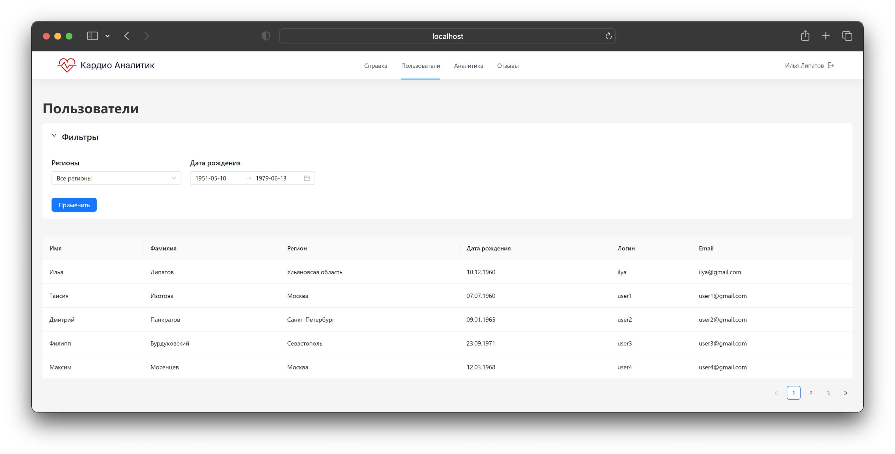
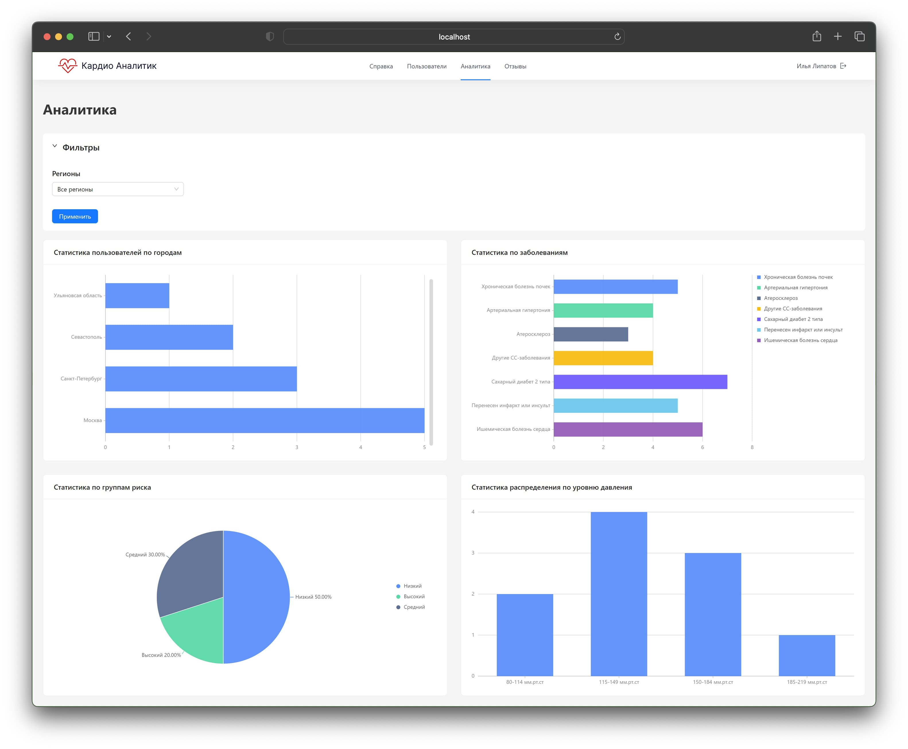
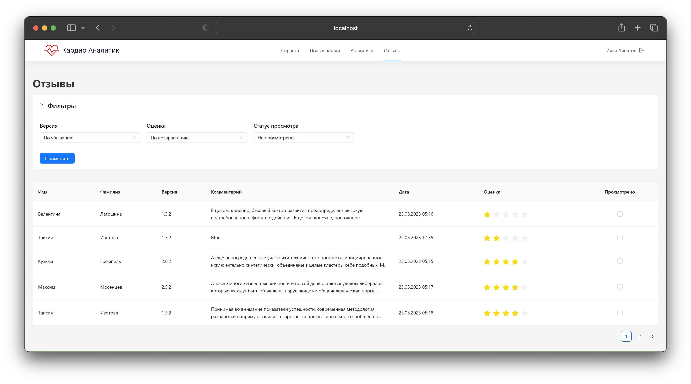
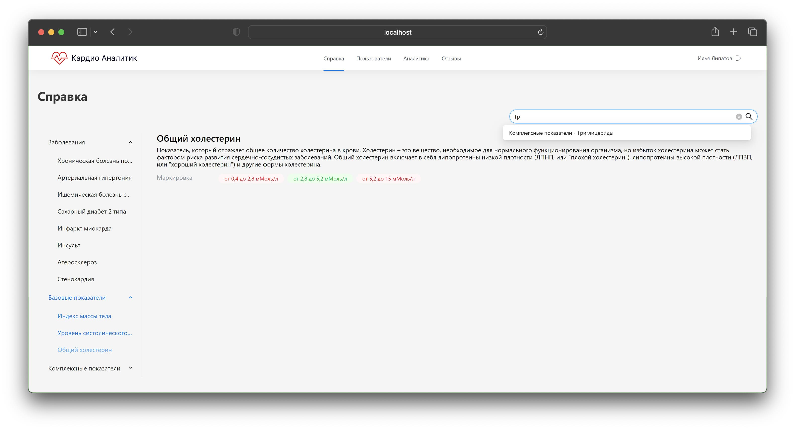
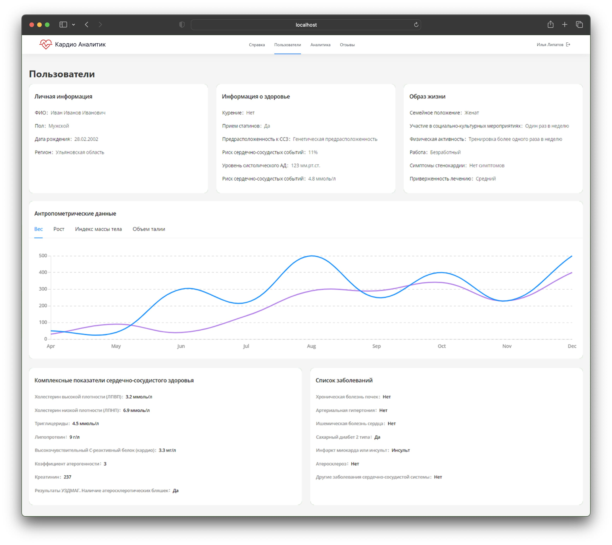
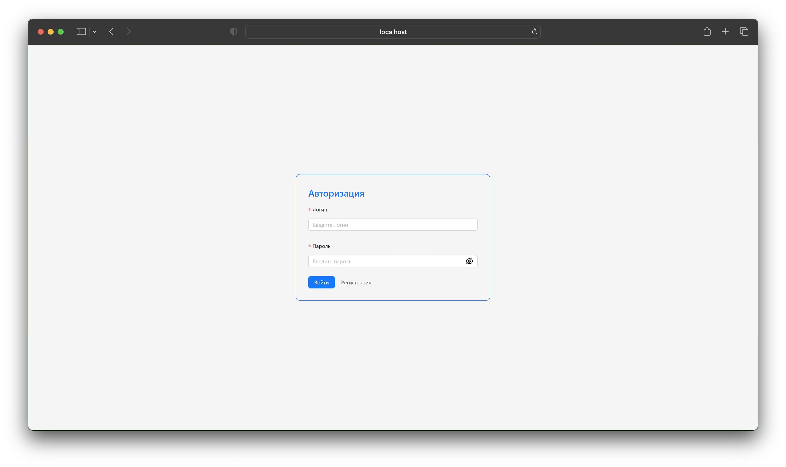
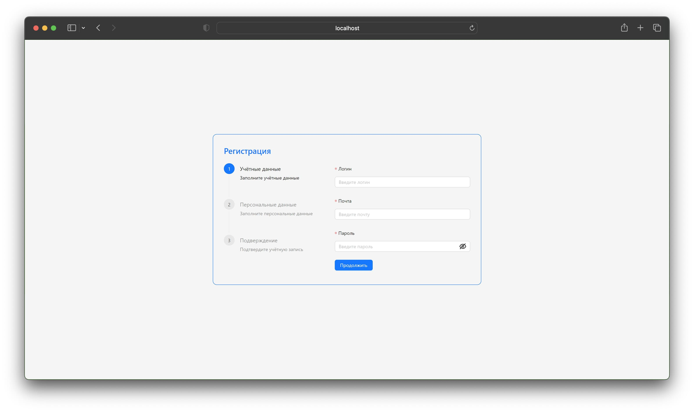
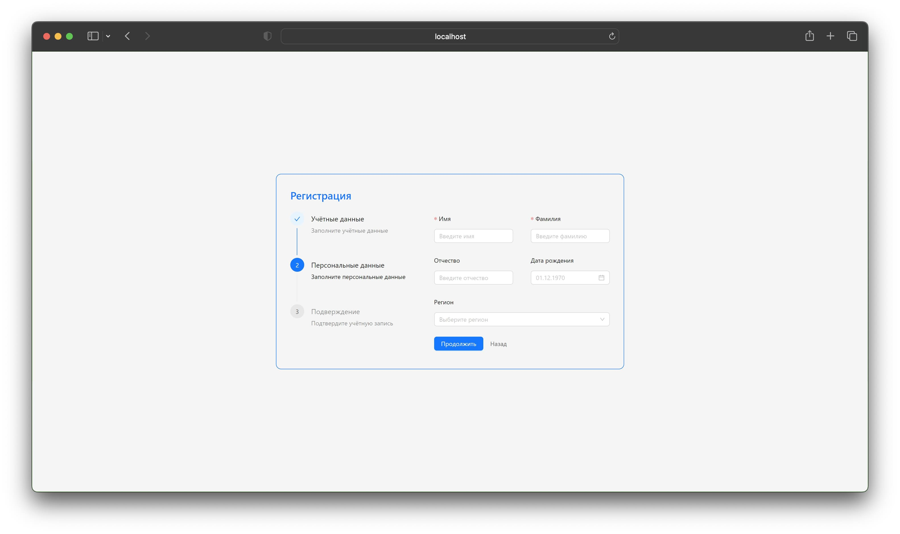
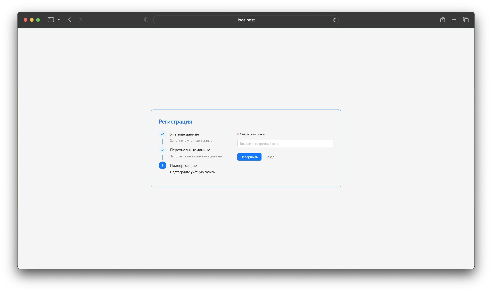

# Cardio Analyst

«Cardio Analyst» — in the conditions of rapid development of technologies and the growth of the amount of medical data, the creation of an innovative web application for patient data analytics of the Cardioanalyst application is an urgent task for the medical community and business associated with the need for effective patient health management and improving the quality of medical care.

### Technology stack:
- React
- TypeScript
- Redux
- Axios
- Ant Design
- Jest
- React Router

## Users:

## Analytics:

## Reviews:

## Guide:

## User:

## Login:

## singup step 1:

## singup step 12:

## singup step 3:

